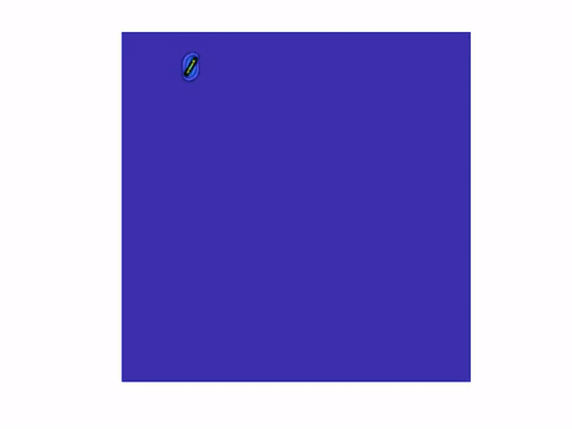

# Falling Elliptical Cylinder Simulation using LBM

A MATLAB implementation of the Lattice Boltzmann Method (LBM) to simulate the motion of an elliptical cylinder falling under gravity in a channel. The simulation captures both translational and rotational motion of the cylinder while considering fluid-structure interaction.
<p align="center">
  
</p>

## Features

- D2Q9 Lattice Boltzmann Method implementation
- Fluid-structure interaction modeling
- Real-time visualization of flow field
- Periodic boundary conditions on lateral walls
- Moving boundary conditions on top and bottom walls
- Force and torque calculations on the cylinder
- Automatic data export for post-processing

## Prerequisites

- MATLAB (Tested on R2019b or later)
- Image Processing Toolbox (for visualization)

## Usage

1. Clone the repository:
```bash
git clone https://github.com/yourusername/falling-elliptical-cylinder-lbm.git
```

2. Run the main simulation:
```matlab
FallingEllipticalCylinder
```

3. Adjust simulation parameters in `FallingEllipticalCylinder.m`:
```matlab
a = 8;              % Semi-Major Axis [Lattice Units]
b = 26;             % Semi-Minor Axis [Lattice Units]
nx = 1000;          % Grid size (x-Direction)
ny = 1000;          % Grid size (y-Direction)
T = 30000;          % Simulation Time
```

## File Structure

- `FallingEllipticalCylinder.m` - Main simulation script
- `defineEllipse.m` - Function to define elliptical cylinder boundary
- `updateGrid.m` - Grid update function for solid and fluid nodes
- `getSimilarPairsId.m` - Helper function for boundary node identification
- `generateImages.m` - Post-processing script for visualization

## Technical Details

- **Lattice Model**: D2Q9 with 9 velocity directions
- **Boundary Treatment**: Half-way bounce-back scheme
- **Flow Regime**: Incompressible flow
- **Collision Operator**: Single-relaxation-time BGK
- **Force Evaluation**: Momentum exchange method

## Output

The simulation generates:
- Real-time velocity magnitude contours
- Force and torque data on the cylinder
- Position and orientation data
- Velocity field data files for post-processing

## Authors

- Divyaprakash (PhD Candidate)
- Applied Mechanics Department, IIT Delhi
- Contact: divyaprakash.poddar@gmail.com

## Acknowledgement
The MATLAB code is written as part of the Final project for the course on Lattice Boltzmann Method taught at IIT Delhi by Dr. Amit Gupta.
His lecture videos fo this course are given in the following link.
https://www.youtube.com/watch?v=HMbM5_TdPsc&list=PLgV-fKI3Z3Qi8hK0zPLgjwkgUA8GawwTT
Please acknowledge if you plan to use this code.

